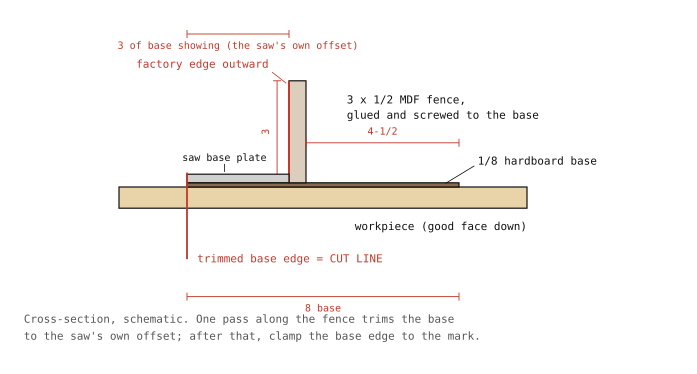
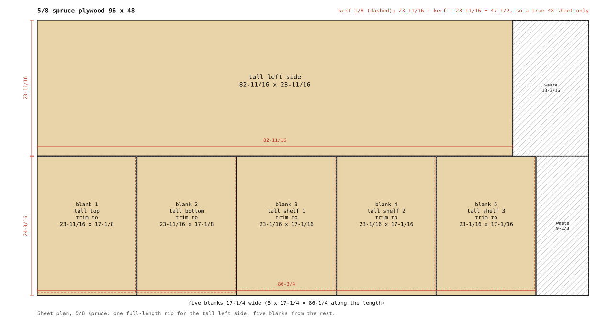
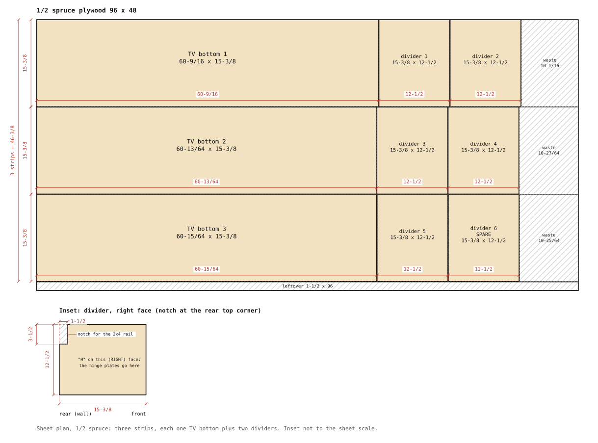
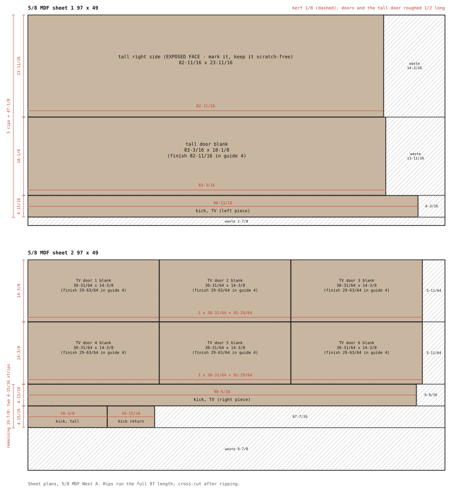
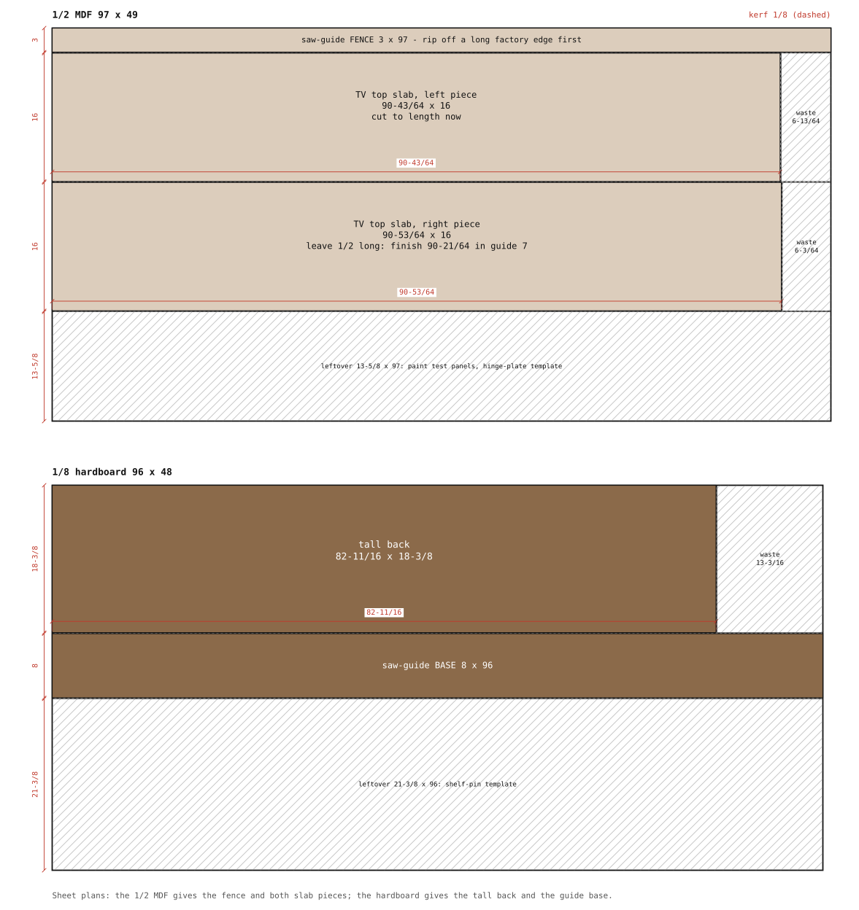
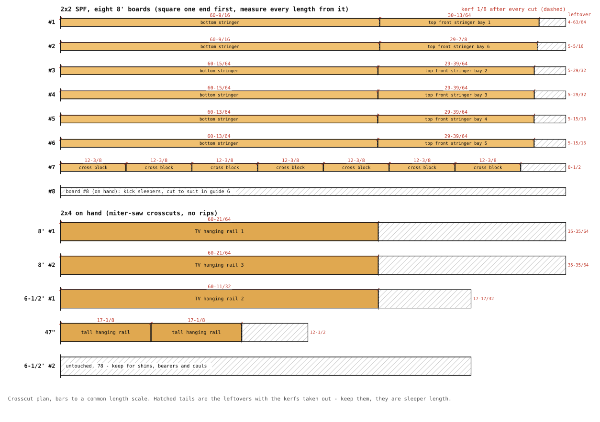

# 2. Cutting

Goal: every part in `../CUTLIST.md` cut, labelled in pencil on a hidden face, and
stacked by group (tall carcass, TV bottoms and dividers, doors, slab, kicks, 2x2, 2x4).
One day. Do not cut the doors or the slab pieces to final size yet; rough them 1/2"
oversize and finish them in guide 4 and guide 7 against the real installed run. The
six top-front stringers are cut on site (guide 3), not here.

## Before the first cut: measure the wall again

Measure the rear wall width at 5" and at 20" above the floor, and at the front edge
of where the cabinets will be (16" out). If any reading is below 199-5/8, open the
Fusion model, set `wall_w` to the smallest reading minus 1/4, and regenerate the cut
list. The doors and slab hide a small gap at the right wall; a bottom or stringer that
is too long cannot be hidden. The tall cabinet width (18-3/8) and depth (24-7/16) are
measured values already.

## Build the saw guide

1. Rip a 3" strip off a long factory edge of the 1/2 MDF sheet. Only its factory
   edge matters, so guide this first cut with a clamped 2x4 sighted straight. This is
   the fence.
2. Cut the hardboard back first (below), then rip an 8" strip off the leftover
   hardboard; this is the base.
3. Glue and screw the fence on top of the base, factory edge outward, with about 3"
   of base showing on the cut side. Run the saw along the fence once; the saw trims
   the base to exactly its own offset. From now on the base edge is the cut line.
   Clamp it to the mark and cut.

Use a fresh 40-tooth or finer blade. Spruce sheathing splinters: tape the line and
cut with the good face down. For MDF doors, tape the line on both faces and cut with
the show face down; the tape stops the edge chipping.

## Cutting order

Rip long strips first, then cross-cut on the miter saw or with the guide. Biggest
pieces from each sheet first. Sizes below are finished sizes; leave the pencil line
on the waste side and measure from the same tape all day. Kerf is 1/8.

### 5/8" spruce plywood (1 sheet, tall carcass)

Tight nest: 23-11/16 + kerf + 23-11/16 = 47-1/2, so it only works on a true 48" sheet.
Check both sheet edges are straight before the first rip.

1. Rip a 23-11/16 strip the full 96" length. Cross-cut the tall left side, 82-11/16.
2. From the remaining 24-3/16 strip, cross-cut five pieces at 17-1/4 (five x 17-1/4 =
   86-1/4 along the length). Their 23-11/16 direction runs across the sheet.
3. Rip two of them to 23-11/16 (top and bottom) and three to 23-1/16 (shelves, 5/8
   short of the front edge). Then trim all five to 17-1/8 wide. Shelves drop in on
   pins, so take another 1/16 off their width (17-1/16) or they will need forcing.

Sight each part for flatness after cutting; a shelf that rocks goes in the middle
position where it matters least.

### 1/2" spruce plywood (1 sheet, TV bottoms and dividers)

1. Rip three 15-3/8 strips the full length (46-3/8 of the 48 width).
2. From each strip, one bottom and two dividers:

| strip | bottom | dividers |
|---|---|---|
| 1 | 60-9/16 (bottom 1, tall cabinet to divider 2 centre) | 2 x 12-1/2 |
| 2 | 60-13/64 (bottom 2, divider 2 centre to divider 4 centre) | 2 x 12-1/2 |
| 3 | 60-15/64 (bottom 3, divider 4 centre to right wall) | 2 x 12-1/2 |

Dividers are 15-3/8 x 12-1/2; six come off the sheet, five are used and one is a
spare. Notch each divider's rear top corner 3-1/2 up x 1-1/2 in for the rail: hand
saw down both shoulders, chisel the waste. Pick the flattest five; the hinge plates
go on them.

### 5/8" MDF (2 sheets, 49 x 97)

Nest A works on any 49 x 97 sheet:

**Sheet 1.** Rip 23-11/16 (tall right side, the exposed face: mark it and keep it
scratch-free), then 18-1/8 (tall door), then one 4-15/16 kick strip. 47-1/8 of the 49
width. Cross-cut the side and door to 82-11/16 plus 1/2 for the door. Cut the kick
strip to 90-11/16 (TV kick, left piece).

**Sheet 2.** Rip two 14-3/8 strips the full length; three TV doors from each at
29-63/64 plus 1/2 each way (3 x 30-31/64 = 91-29/64 fits in 97). From the remaining
20" width rip two 4-15/16 strips: TV kick right piece 90-5/16, tall kick 18-3/8, kick
return 10-15/16.

The TV kick totals 181, cut as 90-11/16 + 90-5/16 so the joint lands behind cross
block 3 (block centres are at 30-29/64, 60-9/16, 90-43/64, 120-49/64 and 150-7/8 from
the tall cabinet), where a sleeper can back it. Nest B (all seven doors on one sheet: 18-1/8 + 14-3/8 + 14-3/8 +
2 kerfs = 47-1/8) also works on a true 49" sheet but not on 48".

### 1/2" MDF (1 sheet, TV top slab)

After the 3" fence strip: rip two 16" strips the full 97 length. Slab left piece
90-43/64 (tall cabinet side to divider 3 centre), right piece 90-21/64 (divider 3
centre to right wall). Cut the left piece to length now, leave the right one 1/2 long
for fitting in guide 7. Leftover 13-3/4 x 97 strip: keep it for paint test panels and
the hinge-plate template.

### 1/8" hardboard (1 sheet, tall back)

One piece 82-11/16 x 18-3/8. Leftover 29-5/8 x 96: saw-guide base, shelf-pin template.

### 2x2 (8 boards)

Square one end of each board first, then measure every length from that end. Sight
each board and put the straightest into the stringers.

| board | cuts | leftover |
|---|---|---|
| #1 | stringer 60-9/16 + top front 30-13/64 | 4-63/64 |
| #2 | stringer 60-9/16 + top front 29-7/8 | 5-5/16 |
| #3, #4 | stringer 60-15/64 + top front 29-39/64 | 5-59/64 each |
| #5, #6 | stringer 60-13/64 + top front 29-39/64 | 5-15/16 each |
| #7 | seven cross blocks 12-3/8 | 8-1/2 |
| #8 (on hand) | kick sleepers, cut to suit (guide 6) | — |

Cut the stringer pieces now: rear and front bottom stringers are each 60-9/16 +
60-13/64 + 60-15/64 = 181, joints under dividers 2 and 4. Cut the top-front
stringer stock to the lengths in the table only if you trust the wall; otherwise
leave those six pieces at 31" and cut them to fit between the dividers on site.
Leftovers are under 6" on six boards, so there is no slack; the leftovers are sleeper
length, keep them.

### 2x4 (rails, on hand)

Five crosscuts on the miter saw, no rips.

| board | cut | leftover |
|---|---|---|
| 8' #1 | TV rail 60-21/64 (end rail) | 35-43/64 |
| 8' #2 | TV rail 60-21/64 (end rail) | 35-43/64 |
| 6-1/2' #1 | TV rail 60-11/32 (middle rail) | 17-21/32 |
| 47" | both tall rails 17-1/8 | 12-5/8 |
| 6-1/2' #2 | untouched | 78" |

Run the block plane down both long edges of the tall rails' rear face to take the
rounded factory arris off, so the hardboard back nails flat. The TV rails need no
planing; their rear face sits against drywall.

Keep the 78" board and the offcuts: shims and blocking at the wall in guide 6,
bearers under the sheets while you break them down, cauls for the slab in guide 7.

## Labelling

Write the part name from the cut list on a hidden face of every piece in pencil, plus
an arrow pointing to the front edge, and on dividers an "H" on the RIGHT face: the
door that hinges on a divider sits to its right, so that face carries the hinge
plates. Number the doors 1 to 6 from the tall cabinet. Sand cut edges lightly with 120 to knock off splinters; no more than that.
