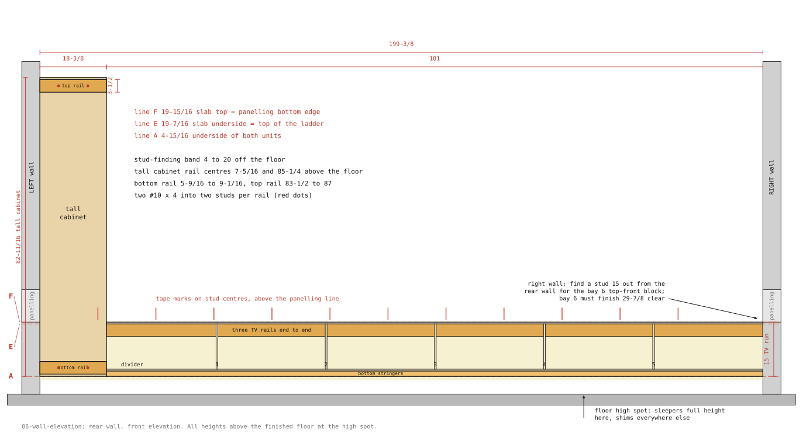
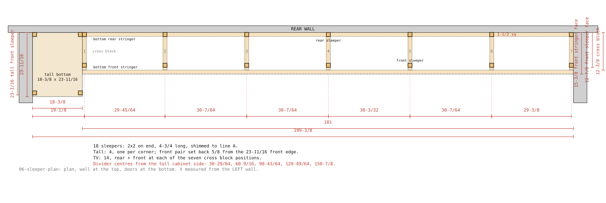
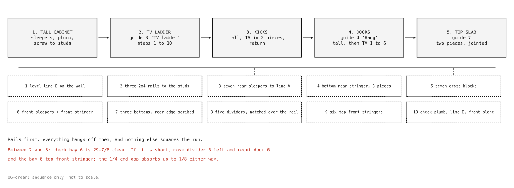
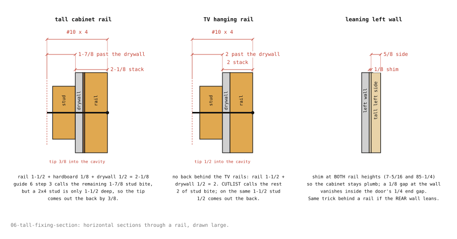
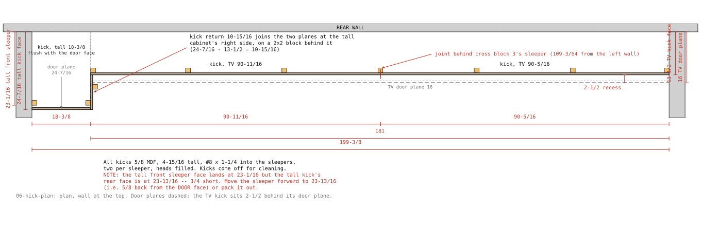

# 6. Installation

One to two days, a helper for the tall cabinet. Everything painted, doors off,
hinges set. You need a 4' level, a laser level or string line, a stud finder, shims,
the #10 x 4" structural screws, the 2x2 offcuts and board #8, and guide 3 open at
"TV ladder": the ladder IS the installation of the TV run.

## Reference

1. Find every stud on the rear wall between 4" and 20" off the floor and mark the
   centres with tape above the panelling line so the marks survive. Also find studs
   on the left wall (tall cabinet shims) and the right wall at 15" out (bay 6 block).
2. Mark the panelling bottom edge, 19-15/16, on both end walls. That is the slab top
   (line F). Slab underside and top of the ladder: 19-7/16 (line E). Level a line E
   along the rear wall.
3. Everything stands 4-15/16 off the floor (line A). Check the floor along the wall
   with the level and find the high spot; sleepers there are full height, everywhere
   else they get shims.

## Sleepers

2x2 blocks on end, 4-3/4 long, shimmed to line A. From board #8 and the 2x2
leftovers (they are already sleeper length):

- Tall cabinet: four, one under each corner of the bottom panel, the front pair
  flush with the panel's front edge, front face 23-13/16 from the wall (the panel
  sits 1/8 off the wall behind the hardboard back and is 23-11/16 deep). That is
  where the flush kick's rear face lands, so the kick screws to them.
- TV run: fourteen, front and rear under each of the seven cross block positions
  (guide 3 steps 3 and 6). Rear ones tight to the wall; front ones with their front
  face 12-7/8 from the wall, which puts the kick face 2-1/2 behind the doors.

No adjustable legs and no kick clips: the kicks screw to the sleepers.

## Order

**Tall cabinet first.**
1. Set its four sleepers, stand the box on them against the left wall and rear wall.
   Plumb the front edge, level the top both ways, shim the sleepers until the
   underside is on line A. Glue the shims.
2. If the left wall leans, shim between the cabinet side and the wall at the two
   rail heights so the cabinet stays plumb. A 1/8 gap at the wall disappears in the
   door's 1/4 end gap. If the rear wall leans, shim behind the top or bottom rail so
   the box is plumb; the TV rails will get the same treatment.
3. Pilot and drive #10 x 4" through the top rail and bottom rail into two studs each.
   Stack is rail 1-1/2 + hardboard 1/8 + drywall 1/2 = 2-1/8, leaving 1-7/8 in the
   stud. Check plumb after each screw; screws pull a box toward the wall.

   

**TV ladder.** Guide 3, "TV ladder", steps 1 to 10: rails to studs, rear sleepers,
bottom rear stringer, cross blocks, front sleepers and stringer, bottoms, dividers,
top-front stringers. The rails go up first and everything hangs off them, so spend
the time on step 2: the run is only as straight and plumb as the rails.

**Out-of-plumb or wavy wall.** The wall is the back of the TV run. Rails and the
rear stringer are shimmed off the wall so their faces are in one plumb plane (string
lines top and bottom); the dividers then stand plumb without fuss. Any gap that
shows at the rear edge of the bottoms or the slab is scribed, not shimmed: hold the
panel in place, scribe the wall onto it, plane to the line. If the wall leans back at
the top, the slab's rear edge wants to be 16 + the lean; the 1/2 slab is cut 16 deep
and covers up to a 1/4 lean, so check that before cutting the slab.

**Right wall.** Bay 6 should finish 29-7/8 clear (divider 5 right face to the wall).
If the wall measurement in guide 2 was right it will. If bay 6 is short, move
divider 5 left by the difference and recut door 6 and the bay 6 stringer; the 1/4
end gap absorbs up to 1/8 either way without moving anything.

## Kicks

5/8 MDF, 4-15/16 tall, screwed to the sleepers with #8 x 1-1/4, two per sleeper,
heads countersunk and filled. Tall kick 18-3/8, flush with the door face, over the
front pair of tall sleepers. TV kick in two pieces, 90-11/16 and 90-5/16, joint behind
cross block 3's sleeper, front face 2-1/2 behind the door plane. The 10-15/16 return
joins the two planes at the tall cabinet's right side, screwed to a 2x2 block behind
it. Kicks come off for cleaning under the unit.

## Doors

Guide 4, "Hang": tall door first, then TV doors 1 to 6 from the tall cabinet. Set
every reveal to 1/8 with a spacer, bottoms flush with the stringer underside. Open
every door fully; nothing touches the wall, the tall cabinet, a neighbour or the
slab line.

Then guide 7, the top slab.
